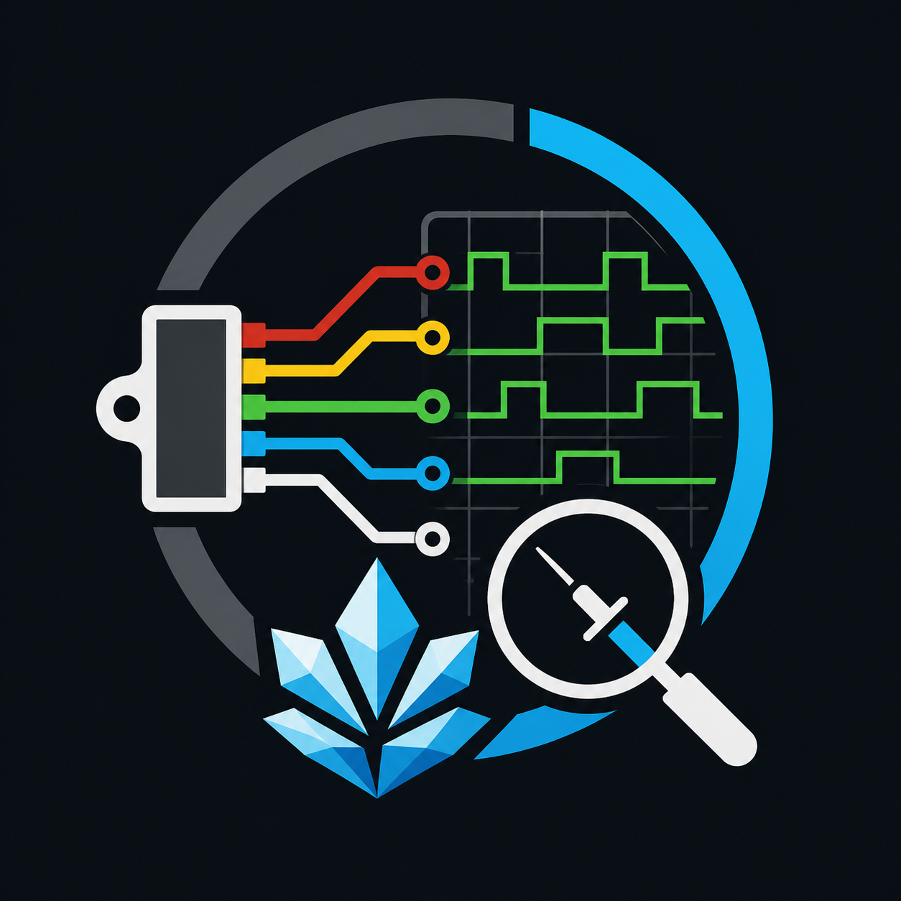
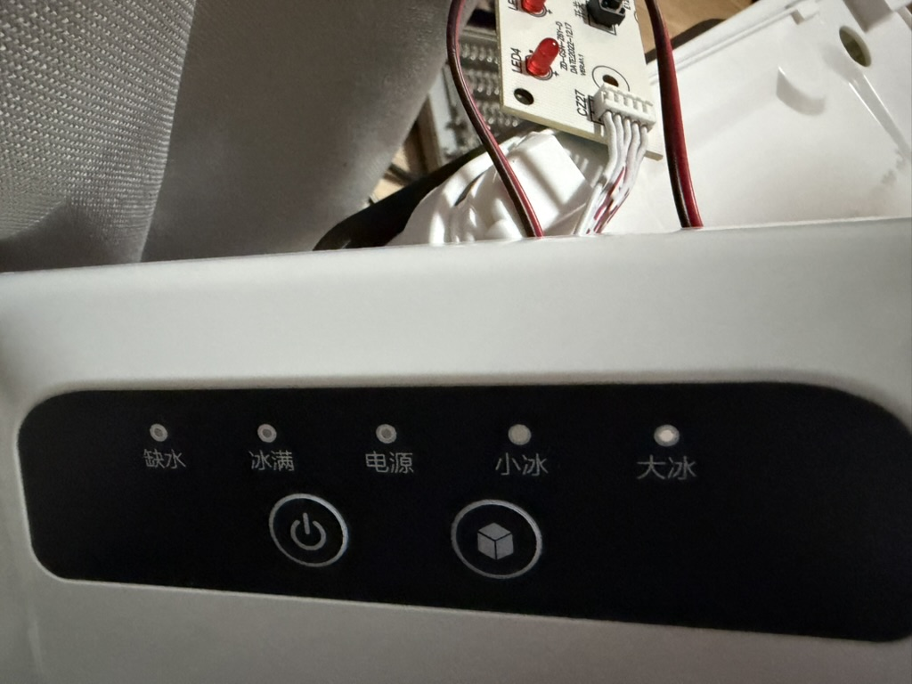
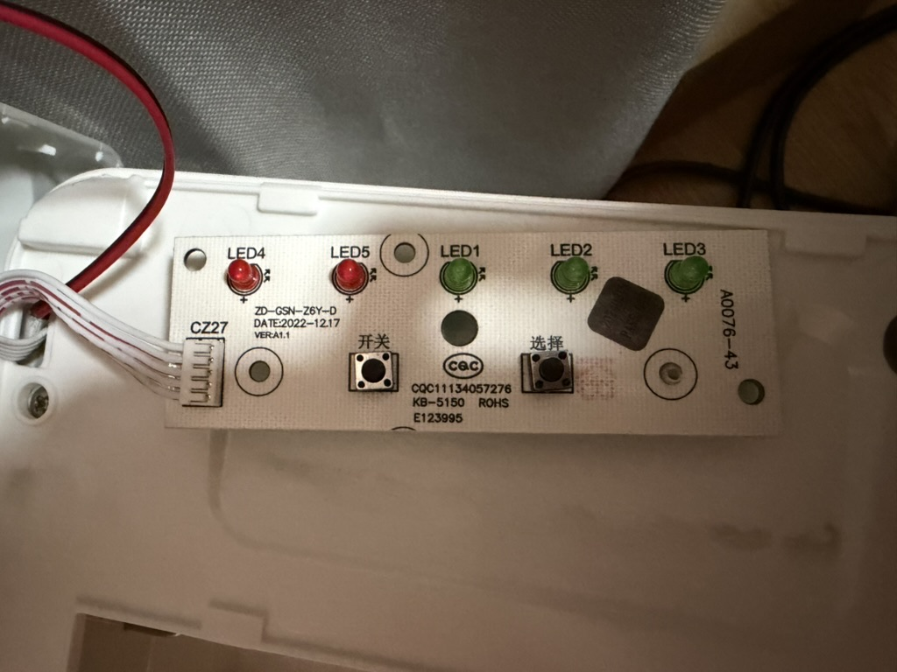
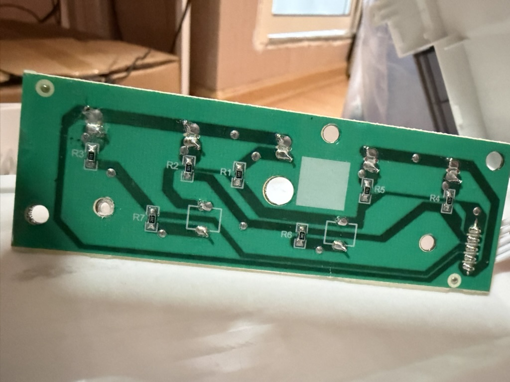

# ESP32-C3 Ice Panel Sniffer And Control Tool

<p align="center">
  
</p>

Language: [中文](README.md) | English

ESP32-C3 tooling for reverse-engineering and bench-controlling the five-wire
ice-maker control panel. The final protocol summary for remote-control software
is in:

```text
ice_panel_sniffer/PANEL_CONTROL_PROTOCOL.md
```

## Related Repository

This repository focuses on electrical reverse engineering, the panel netlist, capture tooling, schematics, and PCB trace diagrams. For the ESPHome / Home Assistant firmware implementation built from the verified protocol, see [chang_hong_ice_maker_esphome](https://github.com/Ljzd-PRO/chang_hong_ice_maker_esphome).

This runbook documents the tested direct-GPIO setup: P1-P5 were connected
straight to GPIO0-GPIO4, and ESP32 GND was not connected to the ice-maker.
That wiring has been disconnected after the analysis task.

## Panel Photos







## Fixed Panel Netlist

```text
P5-P1 : LED5 + R5      ice full
P5-P2 : LED4 + R4      no water
P1-P2 : SW1 + R6       power button
P1-P3 : SW2 + R7       select button
P3-P4 : R3 + LED3      large ice
P2-P4 : R2 + LED2      small ice
P1-P4 : R1 + LED1      power LED
```

Default ESP32-C3 mapping:

```text
P1 -> GPIO0 / ADC1_CH0
P2 -> GPIO1 / ADC1_CH1
P3 -> GPIO2 / ADC1_CH2
P4 -> GPIO3 / ADC1_CH3
P5 -> GPIO4 / ADC1_CH4
```

If GPIO2 prevents boot, move `P3` to GPIO5 and update `PANEL_PINS` in
`ice_panel_sniffer.ino` to `{0, 1, 5, 3, 4}`. Treat P3 as a digital-only channel
in that fallback wiring.

## Direct-GPIO Safety Contract

This direct setup is an accepted-risk, short-duration debug mode. The ESP32-C3
GPIO input high limit is about `VDD + 0.3 V`; the panel has already shown 4.x V
node differences. ADC samples are therefore relative correlation data, not
calibrated panel voltages.

- Keep ESP32 GND disconnected from the ice-maker.
- Run the Mac from battery if possible.
- Keep captures short and stop if ESP32 resets, gets warm, or the ice-maker
  panel behaves abnormally.
- The firmware configures all panel pins as floating inputs by default.
- Active button simulation commands exist for manual tests, but they directly
  touch the panel lines and are riskier than passive capture.
- For a safer next revision, add per-node series resistors, clamps, and weak
  biasing before doing long captures, and use isolated contacts for button
  simulation.

## Dependencies

Python dependencies are isolated in a dedicated venv:

```sh
/Users/ljzd/.cache/codex-runtimes/codex-primary-runtime/dependencies/python/bin/python3 -m venv .venv-ice-panel
.venv-ice-panel/bin/python -m pip install -r ice_panel_sniffer/requirements.txt
```

Arduino CLI:

```sh
brew install arduino-cli
arduino-cli core update-index
arduino-cli core install esp32:esp32
```

If the ESP32 core download fails with a transient EOF from GitHub, rerun the last
command.

## Build And Flash

Before flashing, unplug the ice-maker AC power, wait 30 seconds, and temporarily
disconnect P1-P5 from the ESP32 side. Flash with only USB-C connected to the Mac.

```sh
arduino-cli compile --clean --fqbn esp32:esp32:esp32c3:CDCOnBoot=cdc ice_panel_sniffer
arduino-cli upload -p /dev/cu.usbmodem1101 --fqbn esp32:esp32:esp32c3:CDCOnBoot=cdc ice_panel_sniffer
```

After upload, open the serial capture only long enough to confirm the sniffer
header. Then disconnect the serial program, restore P1-P5 while the ice-maker is
still off, and only then power the ice-maker back to standby.

`CDCOnBoot=cdc` is required for this ESP32-C3 Super Mini style board so `Serial`
uses the USB-C port.

The firmware prints:

```text
A,<us>,<p1_raw>,<p2_raw>,<p3_raw>,<p4_raw>,<p5_raw>,<mask>
E,<us>,<mask>
H,<us>,<mode>,<mask>
```

`mask` uses bit0=P1 through bit4=P5.

Firmware serial commands:

```text
mode adc
mode edge
adc_us <200..1000000>
heartbeat_us <100000..10000000>
status
help
release
sw2_weak [ms]
sw2_od [ms]
sw2_hold_od [ms]
sw2_pair_od [ms]
sw1_weak [ms]
sw1_od [ms]
sw1_hold_od [ms]
sw1_pair_od [ms]
```

Active command meanings:

```text
sw1_weak 120       P2/GPIO1 input with internal pulldown for 120 ms
sw1_od 100         P2/GPIO1 open-drain low for 100 ms, then all pins float
sw1_hold_od 5000   P2/GPIO1 open-drain low for 5 seconds, then all pins float
sw1_pair_od 80     P1/GPIO0 and P2/GPIO1 open-drain low for 80 ms
sw2_weak 120       P3/GPIO2 input with internal pulldown for 120 ms
sw2_od 80          P3/GPIO2 open-drain low for 80 ms, then all pins float
sw2_hold_od 5000   P3/GPIO2 open-drain low for 5 seconds, then all pins float
sw2_pair_od 60     P1/GPIO0 and P3/GPIO2 open-drain low for 60 ms
release            restore all panel pins to floating inputs
```

Observed direct-GPIO result:

```text
sw2_weak 120       no stable mode change
sw2_od 80          successfully simulated one select short press
sw1_od 100         successfully simulated one power short press, running to standby
sw2_hold_od 5000   successfully toggled UV mode on and off
```

Use these as the current working control commands:

```text
sw1_od 100         power short press
sw2_od 80          select short press
sw2_hold_od 5000   select long press, UV toggle
```

Do not hold the output longer than needed; if anything looks abnormal, run
`release`, stop the capture, and unplug the ice-maker.

`sw1_hold_od 5000` was added during testing after a mistaken request, but it is
not part of the recommended remote-control interface.

## Capture

List ports:

```sh
.venv-ice-panel/bin/python ice_panel_sniffer/tools/capture_panel.py --list-ports
```

Capture interactive standby ADC data:

```sh
.venv-ice-panel/bin/python ice_panel_sniffer/tools/capture_panel.py \
  --port /dev/cu.usbmodem1101 \
  --mode adc \
  --adc-us 1000 \
  --duration-s 0 \
  --label direct_standby_adc
```

Capture digital edge changes:

```sh
.venv-ice-panel/bin/python ice_panel_sniffer/tools/capture_panel.py \
  --port /dev/cu.usbmodem1101 \
  --mode edge \
  --duration-s 90 \
  --label direct_standby_edge
```

Capture button edge changes:

```sh
.venv-ice-panel/bin/python ice_panel_sniffer/tools/capture_panel.py \
  --port /dev/cu.usbmodem1101 \
  --mode edge \
  --duration-s 0 \
  --label direct_buttons_edge
```

During capture, type these into the terminal and press Enter:

```text
mark power_led_off
mark power_led_on
mark sw1_down
mark sw1_up
mark sw2_down
mark sw2_up
mark small_led_on
mark large_led_on
quit
```

Each run writes:

```text
ice_panel_sniffer/captures/<timestamp-label>/raw.csv
ice_panel_sniffer/captures/<timestamp-label>/events.csv
ice_panel_sniffer/captures/<timestamp-label>/report.md
ice_panel_sniffer/captures/<timestamp-label>/*.png
```

Re-analyze an existing event file:

```sh
.venv-ice-panel/bin/python ice_panel_sniffer/tools/capture_panel.py \
  --analyze ice_panel_sniffer/captures/<run>/events.csv
```

## Live Debug Sequence

1. Ice-maker unplugged: wait 30 seconds and disconnect P1-P5 at the ESP32 side.
2. ESP32 only: flash firmware and confirm the serial header appears.
3. Ice-maker still unplugged: restore `P1-P5 -> GPIO0-GPIO4`; do not connect
   ESP32 GND.
4. Power the ice-maker to standby and confirm the original panel still shows
   slow power LED blinking, with other LEDs off.
5. Capture standby ADC with `direct_standby_adc`; mark two or three visible
   power LED on/off transitions.
6. Capture standby edges for 90 seconds with `direct_standby_edge`.
7. Capture button edges with `direct_buttons_edge`; press SW1 three times for
   about 1 second and SW2 three to five times for 0.5-1 second, marking down/up
   events.
8. Only if the panel stays normal, capture running ADC for 180 seconds:

   ```sh
   .venv-ice-panel/bin/python ice_panel_sniffer/tools/capture_panel.py \
     --port /dev/cu.usbmodem1101 \
     --mode adc \
     --adc-us 1000 \
     --duration-s 180 \
     --label direct_running_adc
   ```

9. Trigger no-water or ice-full only with short, reversible actions and mark
   `before_no_water`, `no_water_on`, `before_ice_full`, or `ice_full_on`.

Abort immediately and unplug the ice-maker if ESP32 repeatedly disconnects,
resets, warms up, or the ice-maker panel shows stuck LEDs, missed buttons,
unexpected beeps, or resets.

Expected interpretation:

```text
P1-P4 activity -> LED1 power
P2-P4 activity -> LED2 small ice
P3-P4 activity -> LED3 large ice
P5-P2 activity -> LED4 no water
P5-P1 activity -> LED5 ice full
P1-P2 changes  -> SW1 power scan
P1-P3 changes  -> SW2 select scan
```

## ESPHome Remote-Control Firmware

Use the ESPHome project for Home Assistant integration:

```sh
.venv-esphome/bin/esphome config ice_panel_esphome/ice-maker.yaml
.venv-esphome/bin/esphome compile ice_panel_esphome/ice-maker.yaml
.venv-esphome/bin/esphome upload ice_panel_esphome/ice-maker.yaml --device /dev/cu.usbmodem11301
```

The ESPHome firmware exposes:

```text
Mode select        Off / Small Ice / Large Ice
UV Toggle button   5-second Select hold, no UV state feedback
State text sensor  standby/running_large/running_small/starting/stopping/unknown
Diagnostics        ADC signature, confidence, blink score, ratios, raw P1-P5
```

It keeps all P1-P5 GPIOs as floating inputs except during these verified
open-drain actions:

```text
P2/GPIO1 low for 100 ms    power short press
P3/GPIO2 low for 80 ms     select short press
P3/GPIO2 low for 5000 ms   UV toggle
```

The project was compiled successfully with ESPHome `2026.6.2`. If upload fails
with `No serial data received`, manually enter ESP32-C3 download mode while the
upload command is waiting:

```text
hold BOOT -> tap RESET -> release BOOT
```

If the board has no RESET button:

```text
hold BOOT -> reconnect USB -> release BOOT
```

The generated `ice_panel_esphome/secrets.yaml` is only a placeholder. Replace
the Wi-Fi credentials and Home Assistant API/OTA keys before expecting Home
Assistant discovery or OTA updates to work.
