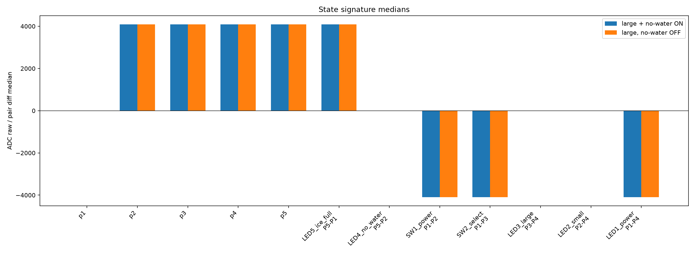
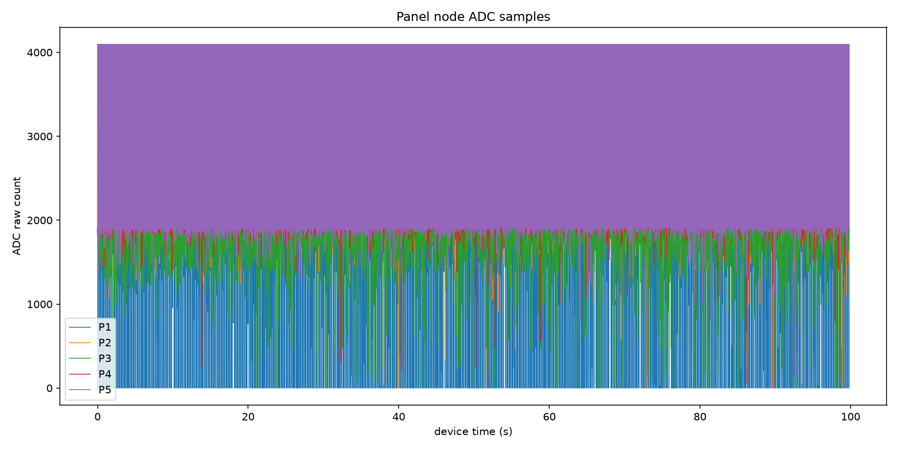
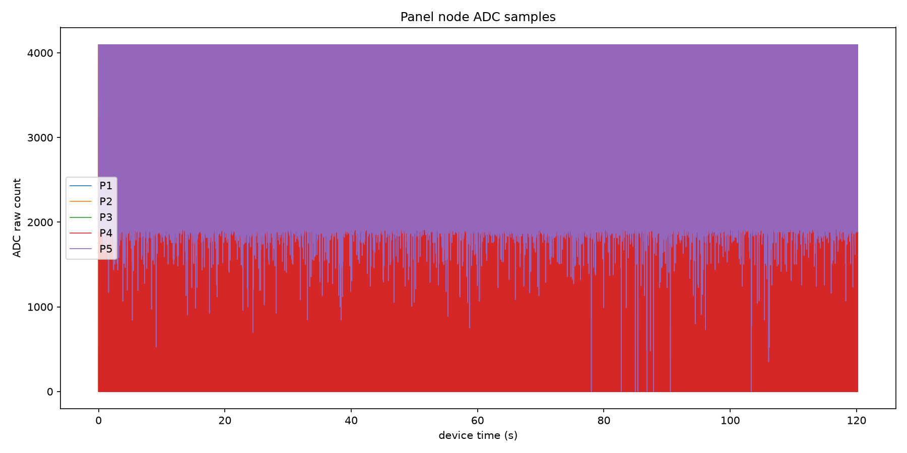
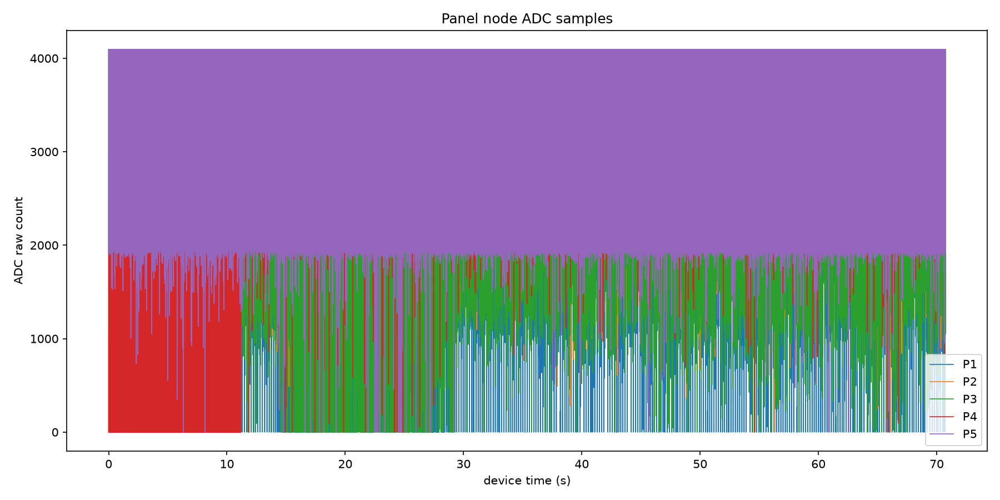
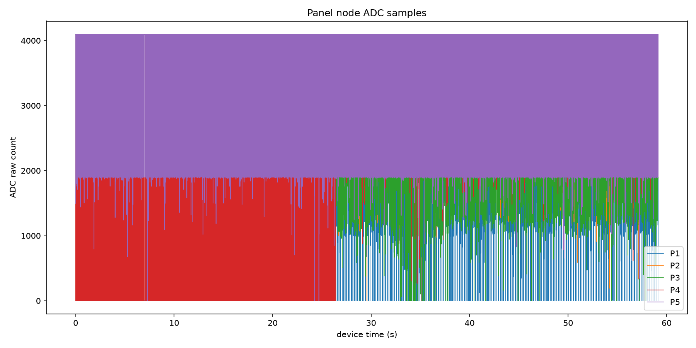
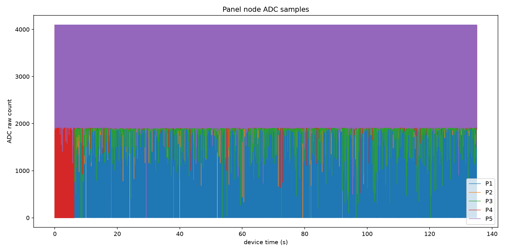
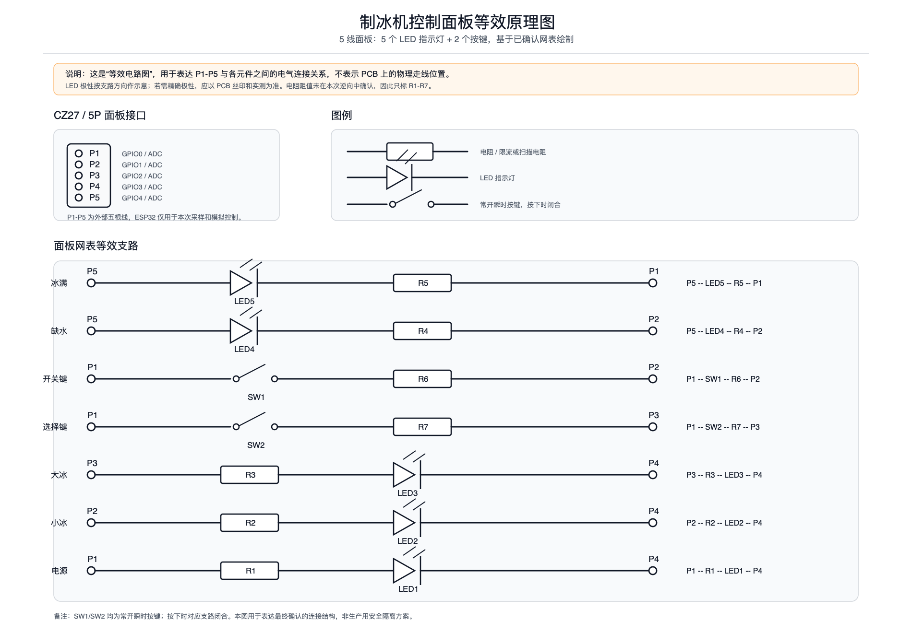
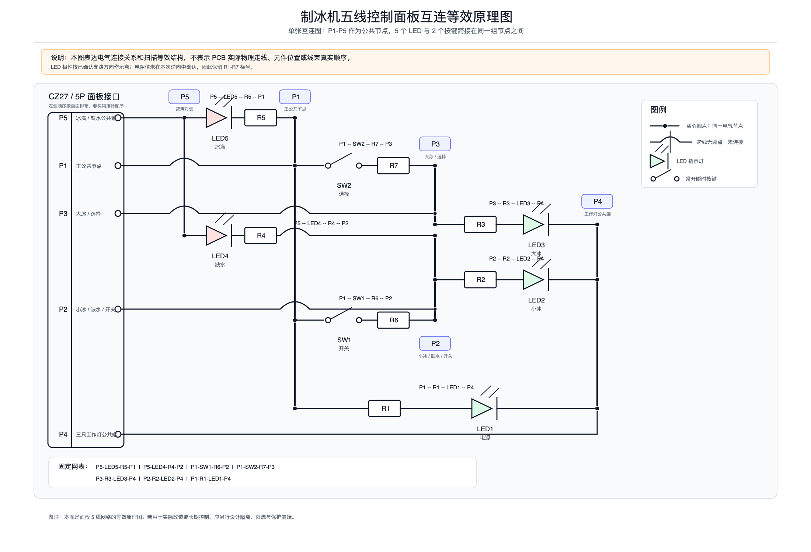
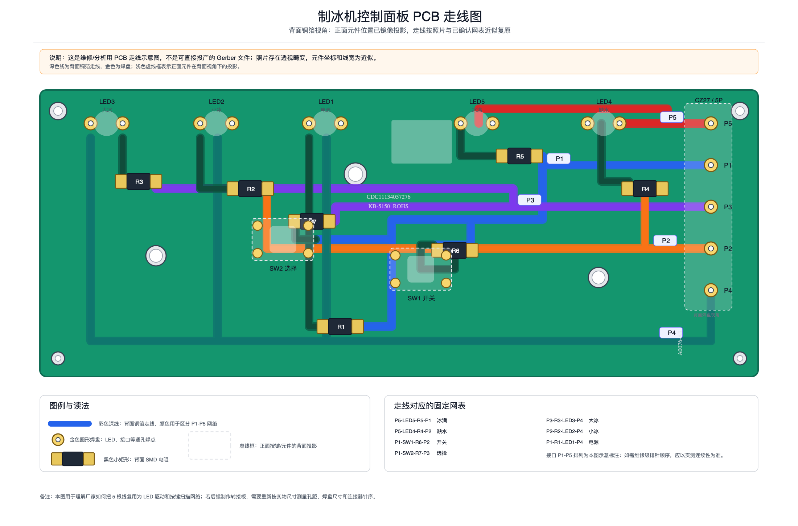

# ESP32-C3 制冰机面板嗅探与控制工具

<p align="center">
  
</p>

语言：中文 | [English](README.en.md)

这是一个基于 ESP32-C3 的工具集，用于逆向分析和台架控制制冰机五线控制面板。供后续远程控制软件使用的最终协议总结在：

```text
PANEL_CONTROL_PROTOCOL.md
```

## 文档入口

- [English README](README.en.md)：本 README 的英文版，适合英文读者快速了解项目、接线和采集流程。
- [控制协议总结](PANEL_CONTROL_PROTOCOL.md)：最终可复用的协议参考，包含固定网表、状态签名、扫描频率和已验证的按键模拟命令。
- [完整逆向分析故事](REVERSE_ENGINEERING_STORY_CN.md)：面向软件开发者的中文长文，完整记录从照片、电压测量、采集失败、实机验证到远程控制成功的全过程。
- [ESP32 原始采集数据包](captures/ice_panel_sniffer-captures-20260630-130202.tar.gz)：包含本次逆向中采集到的串口原始数据、事件标记、自动报告和图表。

## 原始采集数据

本仓库保留了本次实验的 ESP32-C3 原始采集归档：

```text
captures/ice_panel_sniffer-captures-20260630-130202.tar.gz
```

归档压缩后约 32 MB，解压后约 183 MB。里面包含 17 次采集，每次采集通常包括：

```text
raw.csv       ESP32 串口原始数据
events.csv    手动标记和固件事件
report.md     自动分析报告
*.png         ADC 曲线、差分曲线、状态统计图
```

解压示例：

```sh
tar -xzf captures/ice_panel_sniffer-captures-20260630-130202.tar.gz
```

典型数据案例：

- `20260628-203622-direct_standby_adc`：待机状态，电源灯慢闪；用于确认 `MHMHH + 慢闪` 的待机识别逻辑。
- `20260628-205853-direct_large_normal_adc`：大冰运行状态；用于确认 `0HHHH` 大冰签名。
- `20260628-210541-direct_running_select_adc`：人工按“选择”后从大冰切到小冰；用于观察模式切换过程。
- `20260628-211027-direct_running_select_back_adc`：从小冰切回大冰；用于验证反向切换。
- `20260628-212952-direct_sw2_sim_retry_adc` 与 `20260628-213241-direct_sw2_sim_back_adc`：ESP32 模拟“选择”短按成功切换大小冰。
- `20260628-213639-direct_sw1_sim_power_adc`：ESP32 模拟“开关”短按，使机器回到待机。
- `20260628-214710-direct_sw2_hold_5s_uv_adc` 与 `20260628-214855-direct_sw2_hold_5s_uv_off_adc`：ESP32 模拟“选择”长按 5 秒，开启/关闭 UV。
- `20260628-221419-current_state_check_adc` 与 `20260628-221633-current_state_check_2_adc`：最终状态识别校验，两次判断均被实机验证正确。

代表性图表如下。它们是从压缩包内的自动分析图中抽取出来的预览，完整图表仍在原始数据包中。

**状态签名对比总览**



**待机采集：`20260628-203622-direct_standby_adc`**



**大冰运行采集：`20260628-205853-direct_large_normal_adc`**



**人工选择键切换：`20260628-210541-direct_running_select_adc`**



**ESP32 模拟选择键：`20260628-212952-direct_sw2_sim_retry_adc`**



**ESP32 模拟开关键：`20260628-213639-direct_sw1_sim_power_adc`**



## 相关仓库

本仓库专注于电气逆向分析、面板网表、采集工具、原理图和 PCB 走线图。基于已验证协议制作的 ESPHome / Home Assistant 固件实现参考：[chang_hong_ice_maker_esphome](https://github.com/Ljzd-PRO/chang_hong_ice_maker_esphome)。

本文档记录的是已经实测过的直连 GPIO 调试方案：`P1-P5` 直接连接到 `GPIO0-GPIO4`，ESP32 的 GND 不连接到制冰机。分析任务结束后，该接线已经断开。

## 面板照片


## 固定面板网表

```text
P5-P1 : LED5 + R5      冰满
P5-P2 : LED4 + R4      缺水
P1-P2 : SW1 + R6       开关按键
P1-P3 : SW2 + R7       选择按键
P3-P4 : R3 + LED3      大冰
P2-P4 : R2 + LED2      小冰
P1-P4 : R1 + LED1      电源指示灯
```

## 电路图与走线图

下面三张图用于从不同角度理解这块五线面板。

第一张是“网表展开图”，把每条已确认支路单独展开，适合核对连接关系：



[SVG 矢量版](docs/images/panel-schematic-expanded.svg)

第二张是“单张互连等效原理图”，只保留一套 `P1-P5` 公共节点，适合理解厂家如何用 5 根线同时完成 LED 驱动和按键扫描：



[SVG 矢量版](docs/images/panel-schematic-interconnected.svg)

第三张是“PCB 走线示意图”，按背面铜箔视角近似复原，正面元件以镜像投影方式标注。它用于维修和分析，不是可直接投产的 Gerber 文件：



[SVG 矢量版](docs/images/panel-pcb-trace.svg)

默认 ESP32-C3 映射：

```text
P1 -> GPIO0 / ADC1_CH0
P2 -> GPIO1 / ADC1_CH1
P3 -> GPIO2 / ADC1_CH2
P4 -> GPIO3 / ADC1_CH3
P5 -> GPIO4 / ADC1_CH4
```

如果 GPIO2 导致开发板无法启动，可以把 `P3` 改接到 GPIO5，并把 `ice_panel_sniffer.ino` 中的 `PANEL_PINS` 改为 `{0, 1, 5, 3, 4}`。在这种备用接线下，P3 主要按数字通道处理。

## 直连 GPIO 安全约定

这个直连方案是“接受风险、短时调试”的模式。ESP32-C3 GPIO 输入高电平上限约为 `VDD + 0.3 V`，而该面板实测节点电压差已经出现过 4.x V。因此 ADC 采样只能作为相对相关性数据，不能当作校准后的真实面板电压。

- ESP32 GND 不要连接到制冰机。
- 尽量让 Mac 使用电池供电。
- 采集时间保持较短；如果 ESP32 重启、发热，或制冰机面板表现异常，立即停止。
- 固件默认把所有面板引脚配置为浮空输入。
- 固件提供主动按键模拟命令，便于手动测试；但这些命令会直接接触面板线，比被动采集风险更高。
- 更安全的后续版本应给每个节点增加串联电阻、钳位和弱偏置；按键模拟应改用隔离触点。

## 依赖

Python 依赖使用独立 venv：

```sh
/Users/ljzd/.cache/codex-runtimes/codex-primary-runtime/dependencies/python/bin/python3 -m venv .venv-ice-panel
.venv-ice-panel/bin/python -m pip install -r requirements.txt
```

Arduino CLI：

```sh
brew install arduino-cli
arduino-cli core update-index
arduino-cli core install esp32:esp32
```

如果 ESP32 core 下载时遇到 GitHub 临时 EOF 错误，重新运行最后一条命令即可。

## 编译与刷机

刷机前，先拔掉制冰机 AC 电源，等待 30 秒，并临时从 ESP32 一侧断开 `P1-P5`。刷机时只保留 USB-C 连接 Mac。

```sh
arduino-cli compile --clean --fqbn esp32:esp32:esp32c3:CDCOnBoot=cdc .
arduino-cli upload -p /dev/cu.usbmodem1101 --fqbn esp32:esp32:esp32c3:CDCOnBoot=cdc .
```

上传完成后，只需短暂打开串口确认 sniffer header 出现。随后关闭串口程序，在制冰机仍断电的情况下恢复 `P1-P5`，最后再给制冰机上电进入待机。

对于这类 ESP32-C3 Super Mini 开发板，`CDCOnBoot=cdc` 是必要的，这样 `Serial` 才会使用 USB-C 端口。

固件串口输出格式：

```text
A,<us>,<p1_raw>,<p2_raw>,<p3_raw>,<p4_raw>,<p5_raw>,<mask>
E,<us>,<mask>
H,<us>,<mode>,<mask>
```

`mask` 使用 bit0=P1 到 bit4=P5。

固件串口命令：

```text
mode adc
mode edge
adc_us <200..1000000>
heartbeat_us <100000..10000000>
status
help
release
sw2_weak [ms]
sw2_od [ms]
sw2_hold_od [ms]
sw2_pair_od [ms]
sw1_weak [ms]
sw1_od [ms]
sw1_hold_od [ms]
sw1_pair_od [ms]
```

主动控制命令含义：

```text
sw1_weak 120       P2/GPIO1 启用内部下拉 120 ms
sw1_od 100         P2/GPIO1 开漏拉低 100 ms，然后所有引脚恢复浮空
sw1_hold_od 5000   P2/GPIO1 开漏拉低 5 秒，然后所有引脚恢复浮空
sw1_pair_od 80     P1/GPIO0 和 P2/GPIO1 开漏拉低 80 ms
sw2_weak 120       P3/GPIO2 启用内部下拉 120 ms
sw2_od 80          P3/GPIO2 开漏拉低 80 ms，然后所有引脚恢复浮空
sw2_hold_od 5000   P3/GPIO2 开漏拉低 5 秒，然后所有引脚恢复浮空
sw2_pair_od 60     P1/GPIO0 和 P3/GPIO2 开漏拉低 60 ms
release            把所有面板引脚恢复为浮空输入
```

已观察到的直连 GPIO 结果：

```text
sw2_weak 120       未能稳定切换模式
sw2_od 80          成功模拟一次选择键短按
sw1_od 100         成功模拟一次开关键短按，从运行切到待机
sw2_hold_od 5000   成功切换 UV 模式开/关
```

当前可用的控制命令：

```text
sw1_od 100         开关键短按
sw2_od 80          选择键短按
sw2_hold_od 5000   选择键长按，切换 UV
```

不要让输出保持时间超过必要长度；如果出现任何异常，先执行 `release`，停止采集，然后拔掉制冰机电源。

`sw1_hold_od 5000` 是测试过程中因误操作需求加入的命令，不属于推荐的远程控制接口。

## 采集

列出串口：

```sh
.venv-ice-panel/bin/python tools/capture_panel.py --list-ports
```

交互式采集待机 ADC 数据：

```sh
.venv-ice-panel/bin/python tools/capture_panel.py \
  --port /dev/cu.usbmodem1101 \
  --mode adc \
  --adc-us 1000 \
  --duration-s 0 \
  --label direct_standby_adc
```

采集数字边沿变化：

```sh
.venv-ice-panel/bin/python tools/capture_panel.py \
  --port /dev/cu.usbmodem1101 \
  --mode edge \
  --duration-s 90 \
  --label direct_standby_edge
```

采集按键边沿变化：

```sh
.venv-ice-panel/bin/python tools/capture_panel.py \
  --port /dev/cu.usbmodem1101 \
  --mode edge \
  --duration-s 0 \
  --label direct_buttons_edge
```

采集过程中，可以在终端输入这些标记并按 Enter：

```text
mark power_led_off
mark power_led_on
mark sw1_down
mark sw1_up
mark sw2_down
mark sw2_up
mark small_led_on
mark large_led_on
quit
```

每次采集会写出：

```text
captures/<timestamp-label>/raw.csv
captures/<timestamp-label>/events.csv
captures/<timestamp-label>/report.md
captures/<timestamp-label>/*.png
```

重新分析已有事件文件：

```sh
.venv-ice-panel/bin/python tools/capture_panel.py \
  --analyze captures/<run>/events.csv
```

## 实机调试流程

1. 制冰机断电：等待 30 秒，并从 ESP32 一侧断开 `P1-P5`。
2. 只连接 ESP32：刷入固件并确认串口 header 出现。
3. 制冰机仍保持断电：恢复 `P1-P5 -> GPIO0-GPIO4`；不要连接 ESP32 GND。
4. 给制冰机上电进入待机，确认原面板仍表现为电源灯慢闪、其他灯熄灭。
5. 用 `direct_standby_adc` 采集待机 ADC；标记两到三次肉眼可见的电源灯亮/灭变化。
6. 用 `direct_standby_edge` 采集 90 秒待机边沿。
7. 用 `direct_buttons_edge` 采集按键边沿；按 SW1 三次，每次约 1 秒；按 SW2 三到五次，每次 0.5-1 秒，并标记 down/up 事件。
8. 只有在面板表现正常时，才采集 180 秒运行 ADC：

   ```sh
   .venv-ice-panel/bin/python tools/capture_panel.py \
     --port /dev/cu.usbmodem1101 \
     --mode adc \
     --adc-us 1000 \
     --duration-s 180 \
     --label direct_running_adc
   ```

9. 只用短时、可恢复的方式触发缺水或冰满，并标记 `before_no_water`、`no_water_on`、`before_ice_full` 或 `ice_full_on`。

如果 ESP32 反复断开、重启、发热，或制冰机面板出现 LED 卡死、按键失灵、异常蜂鸣、主控复位，应立即停止并拔掉制冰机电源。

预期解释方式：

```text
P1-P4 activity -> LED1 电源
P2-P4 activity -> LED2 小冰
P3-P4 activity -> LED3 大冰
P5-P2 activity -> LED4 缺水
P5-P1 activity -> LED5 冰满
P1-P2 changes  -> SW1 开关键扫描
P1-P3 changes  -> SW2 选择键扫描
```

## ESPHome 远程控制固件

Home Assistant 集成请使用同级 ESPHome 项目：

```sh
cd ../chang_hong_ice_maker_esphome
.venv-esphome/bin/esphome config chang-hong-ice-maker-esphome.yaml
.venv-esphome/bin/esphome compile chang-hong-ice-maker-esphome.yaml
.venv-esphome/bin/esphome upload chang-hong-ice-maker-esphome.yaml --device /dev/cu.usbmodem11301
```

ESPHome 固件暴露：

```text
Mode select        Off / Small Ice / Large Ice
UV Toggle button   5 秒选择键长按，无 UV 状态反馈
State text sensor  standby/running_large/running_small/starting/stopping/unknown
Diagnostics        ADC signature、confidence、blink score、ratios、P1-P5 原始值
```

除了执行这些已验证的开漏动作时，ESPHome 固件会让所有 `P1-P5` GPIO 保持浮空输入：

```text
P2/GPIO1 low for 100 ms    开关键短按
P3/GPIO2 low for 80 ms     选择键短按
P3/GPIO2 low for 5000 ms   UV 切换
```

该项目已经使用 ESPHome `2026.6.2` 成功编译。如果上传失败并提示 `No serial data received`，可以在上传命令等待期间手动让 ESP32-C3 进入下载模式：

```text
hold BOOT -> tap RESET -> release BOOT
```

如果开发板没有 RESET 按键：

```text
hold BOOT -> reconnect USB -> release BOOT
```

生成的 `../chang_hong_ice_maker_esphome/secrets.yaml` 只是占位文件。需要先替换 Wi-Fi 凭据以及 Home Assistant API/OTA 密钥，Home Assistant 发现和 OTA 更新才会正常工作。
